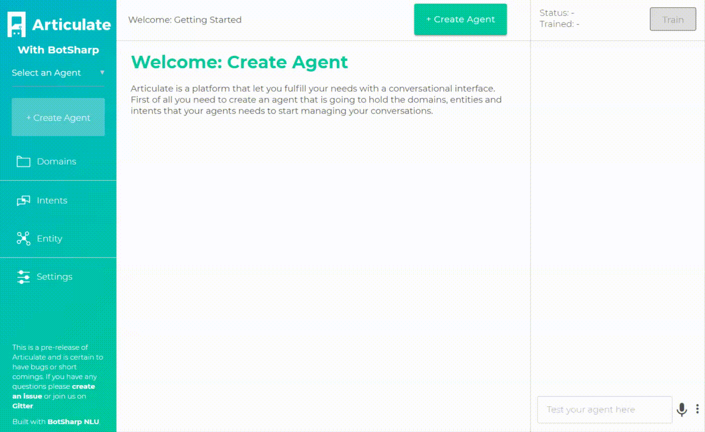

# articulate-ui
Articulate UI customized for BotSharp NLU

This project is tailored from [Articulate](https://github.com/samtecspg/articulate) to adapt [BotSharp NLU](https://github.com/Oceania2018/BotSharp), only keeps the UI folder and remove Rasa NLU related stuff. [Articulate](http://spg.ai/projects/articulate) is a platform for building conversational interfaces with intelligent agents (chatbots). [Rasa NLU](https://github.com/RasaHQ/rasa_nlu) (Natural Language Understanding) is a tool for understanding what is being said in short pieces of text. 

Thanks for Articulate open sourced its awesome project. Let BotSharp has the opportunity to integrate with Articulate to provide the best experience for the chatbot developers.

#### Demo in screen record
This is a music bot connected with IoT device.



download mp4: [botsharp-with-articulate.mp4](botsharp-with-articulate.mp4)

#### How to install
Make sure you have installed BotSharp NLU before you try the UI.
```
git clone https://github.com/Oceania2018/articulate-ui
npm install
npm start
```

Feel free to join [Articulate Gitter](https://gitter.im/samtecspg/articulate?utm_source=badge&utm_medium=badge&utm_campaign=pr-badge&utm_content=badge) and [BotSharp Gitter](https://gitter.im/botsharpcore/Lobby) room.
